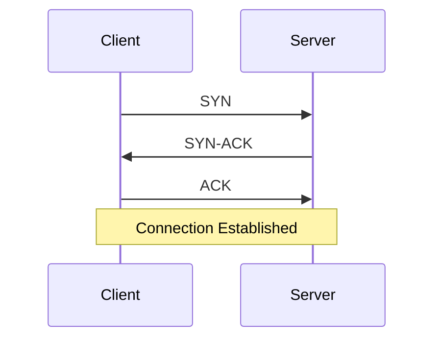
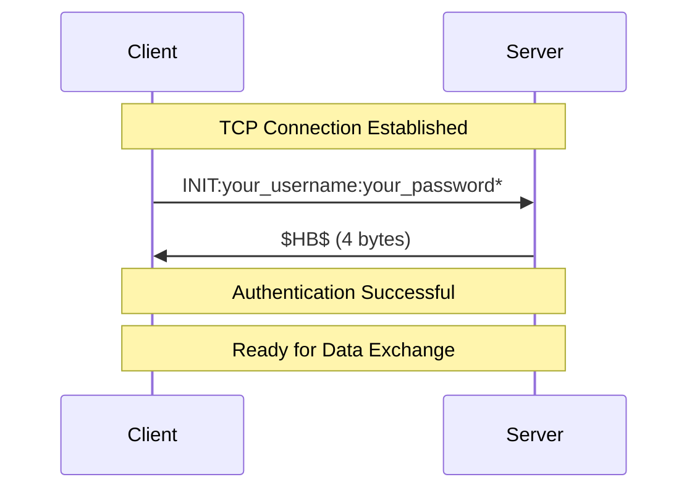
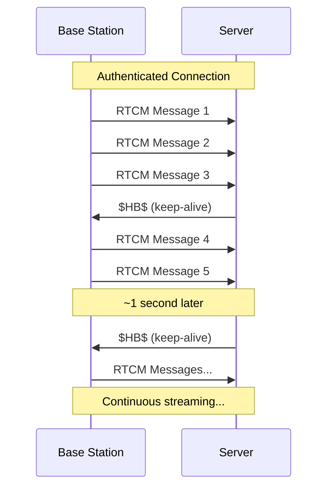
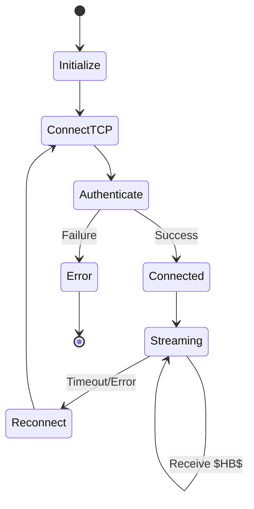

# RTCM Correction Service Connection Protocol

## Document Overview

This document describes the TCP-based connection protocol used by a GPS base station to upload RTCM (Radio Technical Commission for Maritime Services) correction data to an RTCM caster/server. This protocol was reverse-engineered from network traffic analysis and provides the specifications needed to implement a GPS base station uplink tool that reads RTCM data from a serial port and forwards it to the RTCM server.

**Protocol Version:** Custom TCP-based RTCM streaming  
**Analysis Date:** October 26, 2025  
**Service Type:** GPS base station to RTCM caster uplink  
**Data Direction:** Base station → Server (RTCM corrections)  
**Acknowledgment:** Server → Base station ($HB$ heartbeats)

---

## Table of Contents

1. [Protocol Overview](#protocol-overview)
2. [Network Configuration](#network-configuration)
3. [Connection Establishment](#connection-establishment)
4. [Authentication Process](#authentication-process)
5. [Data Flow](#data-flow)
6. [Message Specifications](#message-specifications)
7. [Implementation Guide](#implementation-guide)
8. [Error Handling](#error-handling)
9. [Connection Monitoring](#connection-monitoring)

---

## Protocol Overview

### Purpose

This protocol enables GPS base stations to:
- Authenticate with an RTCM caster/server
- Upload real-time GNSS correction data (RTCM messages) to the server
- Maintain persistent connections with heartbeat acknowledgments
- Provide differential corrections to the RTCM network for distribution to rover clients

### Architecture


**Data Flow:**
- **Base Station → Tool:** RTCM corrections via serial port
- **Tool → Server:** RTCM corrections via TCP (port 50010)
- **Server → Tool:** `$HB$` heartbeat acknowledgments

### Protocol Characteristics

- **Transport:** TCP/IP
- **Authentication:** Plaintext INIT command with `*` terminator
- **Data Format:** Binary RTCM 3.x messages
- **Keep-alive:** Server sends periodic `$HB$` heartbeat (~1 Hz)
- **Connection Type:** Long-lived, persistent streaming connection
- **Data Direction:** Unidirectional upload (base station → server)
- **Flow Control:** No per-message ACK - continuous streaming

---

## Network Configuration

### Server Details

| Parameter | Value |
|-----------|-------|
| **Server IP** | rtcm.example.com |
| **Server Port** | 50010 |
| **Protocol** | TCP |
| **Connection Type** | Client-initiated |

### Client Configuration

| Parameter | Recommendation |
|-----------|----------------|
| **Socket Type** | TCP Stream Socket |
| **Timeout (Connect)** | 10 seconds |
| **Timeout (Read)** | 30 seconds |
| **Keep-alive** | Enabled |
| **Buffer Size** | 4096 bytes minimum |

---

## Connection Establishment

### TCP Handshake

The connection follows standard TCP three-way handshake:



### Connection Steps

1. **Resolve hostname/IP** (if using DNS)
2. **Create TCP socket**
3. **Connect to server** on port 50010
4. **Wait for connection** establishment
5. **Proceed to authentication** immediately after connection

### Pseudocode

```python
# Connection establishment
socket = create_tcp_socket()
socket.set_timeout(10)  # 10 second connection timeout
socket.connect(("rtcm.example.com", 50010))
socket.set_timeout(30)  # 30 second read timeout after connection
```

---

## Authentication Process

### INIT Command Format

The authentication uses a simple text-based INIT command sent immediately after TCP connection establishment.

#### Message Structure

```
INIT:<USERNAME>:<PASSWORD>
```

#### Actual Credentials (from analysis)

```
INIT:your_username:your_password*
```

**Important:** The asterisk (*) is a message terminator, NOT part of the password!

#### Message Specifications

| Field | Value | Length |
|-------|-------|--------|
| Command | `INIT:` | 5 bytes |
| Username | `your_username` | variable |
| Separator | `:` | 1 byte |
| Password | `your_password` | variable |
| Terminator | `*` | 1 byte |
| **Total** | | **18 bytes** |

#### Hex Representation

```
49 4E 49 54 3A 52 4F 44 45 4E 30 31 3A 64 61 65 35 2A
I  N  I  T  :  R  O  D  E  N  0  1  :  d  a  e  5  *
```

### Server Response

Upon successful authentication, the server responds with a 4-byte heartbeat acknowledgment:

```
$HB$
```

#### Response Specifications

| Field | Value | Length |
|-------|-------|--------|
| Message | `$HB$` | 4 bytes |

#### Hex Representation

```
24 48 42 24
$  H  B  $
```

### Authentication Sequence



### Authentication Pseudocode

```python
# Send authentication
auth_message = "INIT:your_username:your_password*"
socket.send(auth_message.encode('ascii'))

# Wait for acknowledgment
response = socket.recv(4)
if response == b'$HB$':
    print("Authentication successful")
    # Proceed to data exchange
else:
    print("Authentication failed")
    socket.close()
```

---

## Data Flow

### Overview

After successful authentication, the connection enters a data streaming phase where:
1. **Base station continuously streams RTCM correction messages to server**
2. **Server sends periodic `$HB$` heartbeat keep-alive messages** (~1 Hz)
3. **No per-message acknowledgment** - RTCM data flows continuously
4. Connection remains open until manually closed or heartbeat timeout
5. If heartbeats stop (>30s), base station stops sending and reconnects

### Message Pattern



### Timing Characteristics

| Event | Interval | Notes |
|-------|----------|-------|
| RTCM Messages (upload) | Continuous | 2-15+ messages per second depending on base station config |
| Heartbeat ($HB$) | ~1 second | Server keep-alive, NOT per-message ACK |
| Heartbeat timeout | 30 seconds | Trigger reconnection if no $HB$ |
| Reconnection delay | 5 seconds initial | Exponential backoff on failures |

### RTCM Message Characteristics

- **Format:** Binary RTCM 3.x protocol
- **Size Range:** 984-1448 bytes (typical)
- **Frequency:** Approximately 1 Hz (once per second)
- **Content:** GPS/GNSS differential corrections

#### RTCM Message Structure (General)

```
┌─────────────┬──────────┬─────────────┬──────────┐
│  Preamble   │  Length  │   Payload   │  CRC-24  │
│   (0xD3)    │ (10 bits)│  (variable) │ (3 bytes)│
└─────────────┴──────────┴─────────────┴──────────┘
```

---

## Message Specifications

### Authentication Messages

#### Client → Server: INIT Command

```
Offset  Hex                                          ASCII
------  -------------------------------------------  -----------------
0x0000  49 4E 49 54 3A 52 4F 44 45 4E 30 31 3A 64  INIT:RODEN01:d
0x0010  61 65 35 2A                                  ae5*
```

**Length:** 18 bytes  
**Encoding:** ASCII  
**Termination:** None (fixed length)

#### Server → Client: Heartbeat Response

```
Offset  Hex                 ASCII
------  ------------------  -----
0x0000  24 48 42 24         $HB$
```

**Length:** 4 bytes  
**Encoding:** ASCII  
**Purpose:** Acknowledgment and keep-alive

### Data Messages

#### Base Station → Server: RTCM Messages

```
Offset  Hex                                          Description
------  -------------------------------------------  -----------------
0x0000  D3 XX XX ...                                 RTCM 3.x message
        │  └─┴─ Length (10 bits)
        └─ Preamble (0xD3)
```

**Length:** Variable (984-1448 bytes typical)  
**Encoding:** Binary  
**Format:** RTCM 3.x standard  
**Direction:** Base station uploads to server

---

## Implementation Guide

### GPS Base Station Uplink Tool Architecture


**Data Flow:**
- **GPS Base Station** generates RTCM correction messages
- **Serial Reader Thread** continuously reads RTCM from serial port
- **Data Buffer** queues RTCM messages for transmission
- **Main Application** streams RTCM data to server via TCP
- **RTCM Server** sends periodic `$HB$` heartbeat messages back

**Note:** This is a one-way uplink tool. The rover/receiver side (RTCM Server → Receiver Tool → GPS Rover) is a separate system not covered in this document.

### Implementation Steps

#### Step 1: Initialize Serial Port

```python
# Configure GPS serial port
serial_port = open_serial_port(
    port="/dev/ttyUSB0",      # Adjust for your system
    baudrate=115200,           # Common GPS baud rate
    bytesize=8,
    parity='N',
    stopbits=1,
    timeout=1
)
```

#### Step 2: Establish TCP Connection

```python
# Connect to RTCM server
rtcm_socket = socket.socket(socket.AF_INET, socket.SOCK_STREAM)
rtcm_socket.settimeout(10)
rtcm_socket.connect(("rtcm.example.com", 50010))
rtcm_socket.settimeout(30)
```

#### Step 3: Authenticate

```python
# Send INIT command
auth_msg = "INIT:RODEN01:dae5*"
rtcm_socket.sendall(auth_msg.encode('ascii'))

# Wait for acknowledgment
response = rtcm_socket.recv(4)
if response != b'$HB$':
    raise AuthenticationError("Failed to authenticate")
```

#### Step 4: Start Data Forwarding Threads

```python
# Thread 1: Read from GPS, forward to application
def gps_reader_thread():
    while running:
        data = serial_port.read(1024)
        if data:
            process_gps_data(data)

# Thread 2: Read RTCM from server, forward to GPS
def rtcm_receiver_thread():
    while running:
        data = rtcm_socket.recv(4096)
        if data:
            if data == b'$HB$':
                # Heartbeat received
                last_heartbeat = time.time()
            else:
                # RTCM data - forward to GPS
                serial_port.write(data)
```

#### Step 5: Monitor Connection Health

```python
def connection_monitor():
    while running:
        time_since_heartbeat = time.time() - last_heartbeat
        if time_since_heartbeat > 30:
            # No heartbeat for 30 seconds - reconnect
            reconnect()
        time.sleep(5)
```

### Complete Application Flow



---

## Error Handling

### Connection Errors

| Error Type | Cause | Recovery Action |
|------------|-------|-----------------|
| Connection Refused | Server unavailable | Retry with exponential backoff |
| Connection Timeout | Network issue | Retry with exponential backoff |
| Connection Reset | Server restart | Immediate reconnection attempt |

### Authentication Errors

| Error Type | Cause | Recovery Action |
|------------|-------|-----------------|
| No Response | Server not responding | Close and reconnect |
| Invalid Response | Wrong credentials | Log error, verify credentials |
| Timeout | Network delay | Retry authentication |

### Data Flow Errors

| Error Type | Cause | Recovery Action |
|------------|-------|-----------------|
| Heartbeat Timeout | Connection lost | Reconnect to server |
| Malformed RTCM | Data corruption | Log and continue |
| Buffer Overflow | Processing too slow | Increase buffer size |

### Error Handling Pseudocode

```python
def handle_connection_error(error):
    retry_count = 0
    max_retries = 5
    base_delay = 1  # seconds
    
    while retry_count < max_retries:
        try:
            delay = base_delay * (2 ** retry_count)  # Exponential backoff
            time.sleep(delay)
            
            # Attempt reconnection
            connect_and_authenticate()
            return True
            
        except Exception as e:
            retry_count += 1
            log_error(f"Retry {retry_count} failed: {e}")
    
    return False  # Max retries exceeded
```

---

## Connection Monitoring

### Heartbeat Monitoring

The server sends `$HB$` messages to indicate the connection is alive. Clients should monitor these messages.

#### Monitoring Strategy

```python
class HeartbeatMonitor:
    def __init__(self, timeout=30):
        self.timeout = timeout
        self.last_heartbeat = time.time()
    
    def heartbeat_received(self):
        self.last_heartbeat = time.time()
    
    def is_alive(self):
        elapsed = time.time() - self.last_heartbeat
        return elapsed < self.timeout
    
    def time_since_heartbeat(self):
        return time.time() - self.last_heartbeat
```

### Connection Health Metrics

Monitor these metrics for connection health:

| Metric | Healthy Range | Action if Outside Range |
|--------|---------------|-------------------------|
| Time since last heartbeat | < 30 seconds | Reconnect |
| RTCM messages per minute | 50-70 | Check connection quality |
| Authentication failures | 0 | Verify credentials |
| Reconnection attempts | < 3 per hour | Investigate network |

### Logging Recommendations

```python
# Log important events
log.info("Connected to RTCM server")
log.info("Authentication successful")
log.debug(f"Received RTCM message: {len(data)} bytes")
log.debug("Heartbeat received")
log.warning(f"No heartbeat for {elapsed} seconds")
log.error("Authentication failed")
log.error("Connection lost, attempting reconnect")
```

---

## Appendix A: Complete Connection Example

### Python Implementation Example

```python
import socket
import time
import threading
import serial

class RTCMForwarder:
    def __init__(self, server_ip, server_port, username, password):
        self.server_ip = server_ip
        self.server_port = server_port
        self.username = username
        self.password = password
        self.socket = None
        self.running = False
        self.last_heartbeat = 0
        
    def connect(self):
        """Establish TCP connection to RTCM server"""
        self.socket = socket.socket(socket.AF_INET, socket.SOCK_STREAM)
        self.socket.settimeout(10)
        self.socket.connect((self.server_ip, self.server_port))
        self.socket.settimeout(30)
        print(f"Connected to {self.server_ip}:{self.server_port}")
        
    def authenticate(self):
        """Send INIT command and wait for acknowledgment"""
        auth_msg = f"INIT:{self.username}:{self.password}"
        self.socket.sendall(auth_msg.encode('ascii'))
        
        response = self.socket.recv(4)
        if response == b'$HB$':
            print("Authentication successful")
            self.last_heartbeat = time.time()
            return True
        else:
            print(f"Authentication failed: {response}")
            return False
    
    def receive_rtcm(self, serial_port):
        """Receive RTCM messages and forward to GPS"""
        buffer = b''
        
        while self.running:
            try:
                data = self.socket.recv(4096)
                if not data:
                    print("Connection closed by server")
                    break
                
                buffer += data
                
                # Check for heartbeat messages
                while b'$HB$' in buffer:
                    idx = buffer.find(b'$HB$')
                    
                    # Process any RTCM data before heartbeat
                    if idx > 0:
                        rtcm_data = buffer[:idx]
                        serial_port.write(rtcm_data)
                        print(f"Forwarded {len(rtcm_data)} bytes to GPS")
                    
                    # Remove heartbeat from buffer
                    buffer = buffer[idx+4:]
                    self.last_heartbeat = time.time()
                    print("Heartbeat received")
                
                # If buffer is large, it's likely RTCM data
                if len(buffer) > 100:
                    serial_port.write(buffer)
                    print(f"Forwarded {len(buffer)} bytes to GPS")
                    buffer = b''
                    
            except socket.timeout:
                print("Socket timeout")
                break
            except Exception as e:
                print(f"Error receiving data: {e}")
                break
    
    def monitor_connection(self):
        """Monitor heartbeat and reconnect if necessary"""
        while self.running:
            time.sleep(5)
            elapsed = time.time() - self.last_heartbeat
            
            if elapsed > 30:
                print(f"No heartbeat for {elapsed:.1f} seconds - reconnecting")
                self.reconnect()
    
    def reconnect(self):
        """Reconnect to server"""
        try:
            if self.socket:
                self.socket.close()
            
            self.connect()
            if self.authenticate():
                print("Reconnected successfully")
            else:
                print("Reconnection failed")
        except Exception as e:
            print(f"Reconnection error: {e}")
    
    def start(self, serial_port):
        """Start the forwarder"""
        self.running = True
        
        # Connect and authenticate
        self.connect()
        if not self.authenticate():
            return False
        
        # Start receiver thread
        receiver_thread = threading.Thread(
            target=self.receive_rtcm,
            args=(serial_port,)
        )
        receiver_thread.start()
        
        # Start monitor thread
        monitor_thread = threading.Thread(target=self.monitor_connection)
        monitor_thread.start()
        
        return True
    
    def stop(self):
        """Stop the forwarder"""
        self.running = False
        if self.socket:
            self.socket.close()

# Usage example
if __name__ == "__main__":
    # Open GPS serial port
    gps_serial = serial.Serial(
        port='/dev/ttyUSB0',
        baudrate=115200,
        timeout=1
    )
    
    # Create forwarder
    forwarder = RTCMForwarder(
        server_ip="rtcm.example.com",
        server_port=50010,
        username="your_username",
        password="your_password"
    )
    
    # Start forwarding
    if forwarder.start(gps_serial):
        print("RTCM forwarder started")
        try:
            while True:
                time.sleep(1)
        except KeyboardInterrupt:
            print("Stopping...")
            forwarder.stop()
            gps_serial.close()
```

---

## Session Termination

### Graceful Disconnect via TCP FIN

Analysis of the complete packet capture reveals that session termination uses **standard TCP graceful close (FIN handshake)** with **no application-level disconnect command**.

#### Disconnect Sequence Observed

The connection terminates using the standard TCP four-way handshake:

```
21:30:37.730706 IP Client > Server: Flags [.], ack 57 (Normal ACK)
21:30:38.153391 IP Client > Server: Flags [F.], seq 12161, ack 57 (Client FIN)
21:30:38.303053 IP Server > Client: Flags [.], ack 12162 (Server ACK of FIN)
21:30:38.303760 IP Server > Client: Flags [F.], seq 57, ack 12162 (Server FIN)
21:30:38.306403 IP Client > Server: Flags [.], ack 58 (Client ACK of FIN)
```

#### Key Findings

1. **No application-level disconnect command** - No text commands like "CLOSE", "EXIT", "QUIT", or "BYE"
2. **Client initiates disconnect** - Client sends TCP FIN flag to close connection
3. **Standard TCP close** - Uses normal TCP graceful shutdown (FIN/ACK handshake)
4. **Last data before disconnect** - Final `$HB$` heartbeat, then ~400ms later, client sends FIN

#### Timing Analysis

```
21:30:37.712 - Server sends last $HB$ heartbeat
21:30:37.730 - Client ACKs the heartbeat
21:30:38.153 - Client sends FIN (423ms after last heartbeat)
21:30:38.303 - Server ACKs FIN and sends its own FIN
21:30:38.306 - Client ACKs server's FIN
```

**Time between last heartbeat and disconnect:** ~423 milliseconds

### Implications for Implementation

#### Client-Initiated Disconnect

To disconnect from the RTCM server:

```python
def disconnect(self):
    """Gracefully disconnect from RTCM server"""
    try:
        # Stop receiver threads
        self.running = False
        
        # Close socket - this sends TCP FIN
        if self.socket:
            self.socket.shutdown(socket.SHUT_RDWR)  # Graceful shutdown
            self.socket.close()
            self.socket = None
        
        print("Disconnected from RTCM server")
    except Exception as e:
        print(f"Error during disconnect: {e}")
```

#### Server-Initiated Disconnect

If the server closes the connection:

1. Client will receive a FIN packet
2. Socket read operations will return empty data (`b''`)
3. Client should detect this and clean up resources

```python
def receive_rtcm(self, serial_port):
    """Receive RTCM messages and forward to GPS"""
    buffer = b''
    
    while self.running:
        try:
            data = self.socket.recv(4096)
            
            # Empty data means server closed connection
            if not data:
                print("Server closed connection (received FIN)")
                break
            
            # Process data...
            
        except Exception as e:
            print(f"Error receiving data: {e}")
            break
```

#### Detection Methods

Monitor for disconnection through:

1. **Empty socket read** - `recv()` returns `b''` when FIN received
2. **Socket exceptions** - `ConnectionResetError`, `BrokenPipeError`, etc.
3. **Heartbeat timeout** - No `$HB$` for 30+ seconds
4. **Write failures** - Errors when sending data to closed socket

### Disconnect Best Practices

#### Graceful Shutdown Procedure

```python
def graceful_shutdown(self):
    """Perform graceful shutdown of RTCM connection"""
    print("Initiating graceful shutdown...")
    
    # 1. Stop accepting new data
    self.running = False
    
    # 2. Wait for threads to finish (with timeout)
    if hasattr(self, 'receiver_thread'):
        self.receiver_thread.join(timeout=5)
    
    if hasattr(self, 'monitor_thread'):
        self.monitor_thread.join(timeout=5)
    
    # 3. Close socket (sends FIN)
    if self.socket:
        try:
            self.socket.shutdown(socket.SHUT_RDWR)
        except:
            pass  # Socket may already be closed
        
        self.socket.close()
        self.socket = None
    
    print("Shutdown complete")
```

#### Handling Unexpected Disconnects

```python
def handle_disconnect(self):
    """Handle unexpected disconnection"""
    print("Connection lost - cleaning up...")
    
    # Clean up resources
    if self.socket:
        try:
            self.socket.close()
        except:
            pass
        self.socket = None
    
    # Decide whether to reconnect
    if self.auto_reconnect:
        print("Attempting to reconnect...")
        self.reconnect()
    else:
        print("Auto-reconnect disabled - staying disconnected")
```

### Summary

- **No special disconnect command required**
- **Use standard TCP socket close** to disconnect
- **Server may close connection at any time** - be prepared
- **Monitor for empty reads** to detect server-initiated disconnect
- **Implement graceful shutdown** for clean resource cleanup

---

## Appendix B: Protocol Summary

### Quick Reference

| Item | Value |
|------|-------|
| **Server** | rtcm.example.com:50010 |
| **Protocol** | TCP |
| **Auth Command** | `INIT:RODEN01:dae5*` |
| **Auth Response** | `$HB$` |
| **Heartbeat** | `$HB$` (every ~1 second) |
| **Data Format** | Binary RTCM 3.x |
| **Message Size** | 984-1448 bytes typical |

### Message Flow Summary

```
Base Station                    Server
  |                               |
  |--- TCP SYN ------------------>|
  |<-- TCP SYN-ACK ---------------|
  |--- TCP ACK ------------------>|
  |                               |
  |--- INIT:your_username:your_password* ->|
  |<-- $HB$ ----------------------|
  |                               |
  |--- RTCM Message (998 bytes) ->|
  |<-- $HB$ ----------------------|
  |                               |
  |--- RTCM Message (1448 bytes)->|
  |<-- $HB$ ----------------------|
  |                               |
  |      (continues...)           |
```

---

## Document Revision History

| Version | Date | Changes |
|---------|------|---------|
| 1.0 | 2025-10-26 | Initial document based on pcap analysis |

---

## Contact & Support

For questions or issues regarding this protocol implementation, refer to the original network capture analysis or contact the RTCM service administrator.

**Document prepared by:** Network Traffic Analysis  
**Source:** capture_file.pcap analysis  
**Analysis Tool:** tcpdump
