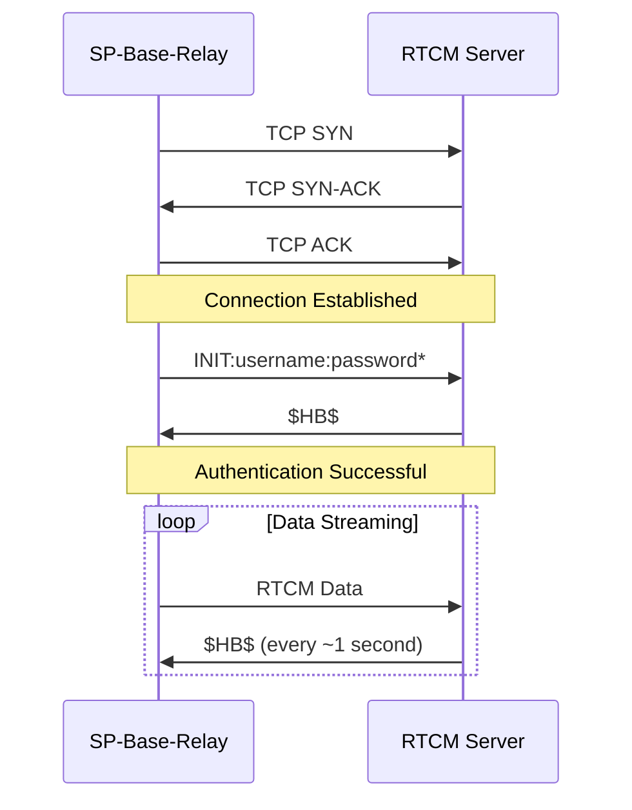

# RTCM Server Integration Guide

## Overview

This document provides detailed specifications for integrating with the custom RTCM correction server, including protocol implementation, authentication flow, and connection management strategies.

## Server Details

### Connection Information
- **Server IP**: rtcm.example.com
- **Server Port**: 50010
- **Protocol**: TCP
- **Connection Type**: Client-initiated, long-lived streaming connection

### Network Configuration
| Parameter | Value |
|-----------|-------|
| **Socket Type** | TCP Stream Socket |
| **Timeout (Connect)** | 10 seconds |
| **Timeout (Read)** | 30 seconds |
| **Keep-alive** | Enabled |
| **Buffer Size** | 4096 bytes minimum |

## Authentication Protocol

### Connection Sequence


### INIT Command Format
**Message Structure:**
```
INIT:<USERNAME>:<PASSWORD>*
```

**Field Specifications:**
| Field | Description | Length | Example |
|-------|-------------|--------|---------|
| Command | Authentication command | 5 bytes | `INIT:` |
| Username | User identifier | Variable | `your_username` |
| Separator | Field delimiter | 1 byte | `:` |
| Password | Authentication password | Variable | `your_password` |
| Terminator | Message terminator | 1 byte | `*` |

**Complete Example:**
```
INIT:your_username:your_password*
```

**Hex Representation:**
```
49 4E 49 54 3A 52 4F 44 45 4E 30 31 3A 64 61 65 35 2A
I  N  I  T  :  R  O  D  E  N  0  1  :  d  a  e  5  *
```

### Authentication Response
**Expected Response:**
```
$HB$
```

**Response Specifications:**
| Field | Value | Length |
|-------|-------|--------|
| Message | `$HB$` | 4 bytes |

**Hex Representation:**
```
24 48 42 24
$  H  B  $
```

### Authentication Implementation
```python
class RTCMAuthentication:
    def __init__(self, username: str, password: str):
        self.username = username
        self.password = password
    
    def create_init_command(self) -> bytes:
        """Create INIT command for authentication"""
        command = f"INIT:{self.username}:{self.password}*"
        return command.encode('ascii')
    
    def authenticate(self, socket: socket.socket) -> bool:
        """Perform authentication handshake"""
        try:
            # Send INIT command
            init_command = self.create_init_command()
            socket.sendall(init_command)
            
            # Wait for $HB$ response
            response = socket.recv(4)
            return response == b'$HB$'
            
        except Exception as e:
            logger.error(f"Authentication failed: {e}")
            return False
```

## Heartbeat Monitoring

### Heartbeat Protocol
- **Message**: `$HB$` (4 bytes)
- **Frequency**: Approximately 1 Hz (every ~1 second)
- **Purpose**: Connection keep-alive and server acknowledgment
- **Timeout**: 30 seconds (trigger reconnection if no heartbeat)

### Heartbeat Implementation
```python
class HeartbeatMonitor:
    def __init__(self, timeout: int = 30):
        self.timeout = timeout
        self.last_heartbeat = 0
        self.running = False
        
    def monitor_heartbeats(self, socket: socket.socket) -> None:
        """Monitor incoming heartbeat messages"""
        buffer = b''
        
        while self.running:
            try:
                data = socket.recv(4096)
                if not data:
                    # Connection closed by server
                    break
                    
                buffer += data
                
                # Process all heartbeat messages in buffer
                while b'$HB$' in buffer:
                    idx = buffer.find(b'$HB$')
                    
                    # Remove heartbeat from buffer
                    buffer = buffer[idx+4:]
                    
                    # Update last heartbeat timestamp
                    self.last_heartbeat = time.time()
                    logger.debug("Heartbeat received")
                    
            except socket.timeout:
                # Check for timeout
                if self.is_timeout():
                    logger.warning(f"Heartbeat timeout after {self.timeout}s")
                    break
            except Exception as e:
                logger.error(f"Heartbeat monitoring error: {e}")
                break
    
    def is_timeout(self) -> bool:
        """Check if heartbeat has timed out"""
        if self.last_heartbeat == 0:
            return False  # No heartbeat received yet
        
        elapsed = time.time() - self.last_heartbeat
        return elapsed > self.timeout
    
    def time_since_heartbeat(self) -> float:
        """Get seconds since last heartbeat"""
        if self.last_heartbeat == 0:
            return 0
        return time.time() - self.last_heartbeat
```

## Data Streaming

### RTCM Data Format
- **Format**: Binary RTCM 3.x messages
- **Size Range**: 984-1448 bytes (typical)
- **Frequency**: Continuous streaming (varies by base station configuration)
- **Processing**: Pass-through mode (no validation or modification)

### Data Transmission
```python
class RTCMDataTransmission:
    def __init__(self, socket: socket.socket, metrics_collector):
        self.socket = socket
        self.metrics = metrics_collector
        
    def send_rtcm_data(self, data: bytes) -> bool:
        """Send RTCM data to server"""
        try:
            self.socket.sendall(data)
            self.metrics.rtcm_data_sent(len(data))
            return True
        except Exception as e:
            logger.error(f"Failed to send RTCM data: {e}")
            self.metrics.rtcm_send_error()
            return False
    
    def is_connected(self) -> bool:
        """Check if socket is still connected"""
        try:
            # Use send with MSG_DONTWAIT to test connection
            self.socket.send(b'', socket.MSG_DONTWAIT)
            return True
        except socket.error:
            return False
```

## Connection Management

### Connection States
```python
from enum import Enum

class ConnectionState(Enum):
    DISCONNECTED = "disconnected"
    CONNECTING = "connecting"
    AUTHENTICATING = "authenticating" 
    CONNECTED = "connected"
    RECONNECTING = "reconnecting"
    ERROR = "error"
```

### Retry Strategy
**Exponential Backoff Parameters:**
- **Initial Delay**: 1 second
- **Maximum Delay**: 60 seconds
- **Backoff Multiplier**: 2x
- **Maximum Attempts**: No limit (continuous retry)

```python
class ConnectionRetryHandler:
    def __init__(self, initial_delay: int = 1, max_delay: int = 60):
        self.initial_delay = initial_delay
        self.max_delay = max_delay
        self.current_delay = initial_delay
        self.attempt_count = 0
        
    def get_next_delay(self) -> int:
        """Calculate next retry delay using exponential backoff"""
        delay = min(self.current_delay, self.max_delay)
        self.current_delay = min(self.current_delay * 2, self.max_delay)
        self.attempt_count += 1
        
        logger.info(f"Retry attempt {self.attempt_count}, waiting {delay}s")
        return delay
    
    def reset(self) -> None:
        """Reset retry parameters after successful connection"""
        self.current_delay = self.initial_delay
        self.attempt_count = 0
        logger.info("Connection successful, retry parameters reset")
```

### Complete Connection Manager
```python
class RTCMConnectionManager:
    def __init__(self, host: str, port: int, username: str, password: str):
        self.host = host
        self.port = port
        self.auth = RTCMAuthentication(username, password)
        self.heartbeat = HeartbeatMonitor()
        self.retry = ConnectionRetryHandler()
        
        self.socket: Optional[socket.socket] = None
        self.state = ConnectionState.DISCONNECTED
        self.running = False
        
    def connect(self) -> bool:
        """Establish connection with authentication"""
        self.state = ConnectionState.CONNECTING
        
        try:
            # Create and configure socket
            self.socket = socket.socket(socket.AF_INET, socket.SOCK_STREAM)
            self.socket.settimeout(10)  # Connection timeout
            self.socket.connect((self.host, self.port))
            self.socket.settimeout(30)  # Read timeout
            
            # Perform authentication
            self.state = ConnectionState.AUTHENTICATING
            if self.auth.authenticate(self.socket):
                self.state = ConnectionState.CONNECTED
                self.retry.reset()
                
                # Start heartbeat monitoring
                self.heartbeat.last_heartbeat = time.time()
                return True
            else:
                self.state = ConnectionState.ERROR
                self.disconnect()
                return False
                
        except Exception as e:
            logger.error(f"Connection failed: {e}")
            self.state = ConnectionState.ERROR
            self.disconnect()
            return False
    
    def disconnect(self) -> None:
        """Close connection and cleanup"""
        if self.socket:
            try:
                self.socket.close()
            except:
                pass
            finally:
                self.socket = None
        
        self.state = ConnectionState.DISCONNECTED
        self.heartbeat.running = False
    
    def reconnect_loop(self) -> None:
        """Continuous reconnection attempts with exponential backoff"""
        while self.running:
            if self.state in [ConnectionState.DISCONNECTED, ConnectionState.ERROR]:
                self.state = ConnectionState.RECONNECTING
                
                # Wait before retry
                delay = self.retry.get_next_delay()
                time.sleep(delay)
                
                # Attempt connection
                if self.connect():
                    logger.info("Reconnection successful")
                    # Resume normal operation
                    break
                else:
                    logger.warning("Reconnection failed, will retry")
```

## Error Handling

### Connection Errors
| Error Type | Cause | Response |
|------------|-------|----------|
| `ConnectionRefusedError` | Server unavailable | Retry with exponential backoff |
| `socket.timeout` | Network latency | Retry connection |
| `socket.gaierror` | DNS resolution | Check server address |

### Authentication Errors
| Error Type | Cause | Response |
|------------|-------|----------|
| No response | Server not responding | Retry authentication |
| Invalid response | Wrong credentials | Log error, continue retrying |
| Timeout | Network delay | Retry with longer timeout |

### Data Transfer Errors
| Error Type | Cause | Response |
|------------|-------|----------|
| `BrokenPipeError` | Connection lost | Trigger reconnection |
| `socket.error` | Network issue | Buffer data briefly, reconnect |
| Heartbeat timeout | Server unresponsive | Trigger reconnection |

## Monitoring and Metrics

### Key Metrics to Track
```python
# Connection metrics
connection_attempts_total = Counter('rtcm_connection_attempts_total')
connection_failures_total = Counter('rtcm_connection_failures_total') 
authentication_failures_total = Counter('rtcm_authentication_failures_total')
connection_status = Gauge('rtcm_connection_status')  # 1=connected, 0=disconnected

# Data flow metrics
rtcm_data_sent_bytes_total = Counter('rtcm_data_sent_bytes_total')
rtcm_messages_sent_total = Counter('rtcm_messages_sent_total')
rtcm_send_errors_total = Counter('rtcm_send_errors_total')

# Heartbeat metrics  
rtcm_heartbeat_last_received = Gauge('rtcm_heartbeat_last_received')
rtcm_heartbeat_timeouts_total = Counter('rtcm_heartbeat_timeouts_total')

# Performance metrics
rtcm_data_throughput_bytes_per_second = Gauge('rtcm_data_throughput_bytes_per_second')
rtcm_connection_uptime_seconds = Gauge('rtcm_connection_uptime_seconds')
```

### Logging Guidelines
```python
# Connection events
logger.info("Connecting to RTCM server", extra={
    "host": self.host, 
    "port": self.port,
    "attempt": self.retry.attempt_count
})

logger.info("Authentication successful", extra={
    "username": self.username,
    "response_time_ms": response_time
})

logger.error("Heartbeat timeout", extra={
    "timeout_seconds": self.heartbeat.timeout,
    "last_heartbeat_ago": self.heartbeat.time_since_heartbeat()
})

# Data flow events  
logger.debug("RTCM data sent", extra={
    "bytes": len(data),
    "total_sent": self.total_bytes_sent
})
```

## Testing Strategies

### Unit Testing
```python
import pytest
from unittest.mock import Mock, patch
import socket

class TestRTCMAuthentication:
    def test_create_init_command(self):
        auth = RTCMAuthentication("testuser", "testpass")
        command = auth.create_init_command()
        assert command == b"INIT:testuser:testpass*"
    
    def test_authenticate_success(self):
        auth = RTCMAuthentication("user", "pass")
        mock_socket = Mock()
        mock_socket.recv.return_value = b'$HB$'
        
        result = auth.authenticate(mock_socket)
        assert result is True
        mock_socket.sendall.assert_called_once_with(b"INIT:user:pass*")
    
    def test_authenticate_failure(self):
        auth = RTCMAuthentication("user", "pass") 
        mock_socket = Mock()
        mock_socket.recv.return_value = b'FAIL'
        
        result = auth.authenticate(mock_socket)
        assert result is False

class TestHeartbeatMonitor:
    def test_heartbeat_timeout_detection(self):
        monitor = HeartbeatMonitor(timeout=30)
        monitor.last_heartbeat = time.time() - 35  # 35 seconds ago
        
        assert monitor.is_timeout() is True
    
    def test_no_timeout_when_recent(self):
        monitor = HeartbeatMonitor(timeout=30)
        monitor.last_heartbeat = time.time() - 10  # 10 seconds ago
        
        assert monitor.is_timeout() is False
```

### Integration Testing with Mock Server
```python
import asyncio
import socket
from threading import Thread

class MockRTCMServer:
    def __init__(self, port: int = 50010):
        self.port = port
        self.running = False
        self.clients = []
        
    def start(self):
        """Start mock server in separate thread"""
        self.running = True
        server_thread = Thread(target=self._run_server)
        server_thread.daemon = True
        server_thread.start()
        
    def _run_server(self):
        server_socket = socket.socket(socket.AF_INET, socket.SOCK_STREAM)
        server_socket.setsockopt(socket.SOL_SOCKET, socket.SO_REUSEADDR, 1)
        server_socket.bind(('localhost', self.port))
        server_socket.listen(5)
        
        while self.running:
            try:
                client_socket, addr = server_socket.accept()
                client_thread = Thread(
                    target=self._handle_client, 
                    args=(client_socket,)
                )
                client_thread.daemon = True
                client_thread.start()
            except Exception:
                break
                
    def _handle_client(self, client_socket):
        """Handle individual client connection"""
        try:
            # Wait for INIT command
            data = client_socket.recv(1024)
            if data.startswith(b'INIT:') and data.endswith(b'*'):
                # Send authentication response
                client_socket.send(b'$HB$')
                
                # Start heartbeat loop
                while self.running:
                    time.sleep(1)
                    client_socket.send(b'$HB$')
                    
        except Exception:
            pass
        finally:
            client_socket.close()

# Integration test
def test_full_connection_cycle():
    # Start mock server
    mock_server = MockRTCMServer(port=50011)
    mock_server.start()
    time.sleep(0.1)  # Allow server to start
    
    # Test client connection
    client = RTCMConnectionManager(
        host="localhost",
        port=50011,
        username="testuser", 
        password="testpass"
    )
    
    # Test connection
    assert client.connect() is True
    assert client.state == ConnectionState.CONNECTED
    
    # Test data sending
    test_data = b'\xd3\x00\x13\x3e\xd7\x00\x00\x00\x00\x00\x00\x00\x00\x00\x00\x00\x00\x00\x00\x8c\x8b\x4c'
    transmission = RTCMDataTransmission(client.socket, Mock())
    assert transmission.send_rtcm_data(test_data) is True
    
    # Cleanup
    client.disconnect()
    mock_server.running = False
```

## Troubleshooting Guide

### Common Issues

**1. Connection Refused**
- **Symptoms**: `ConnectionRefusedError` when attempting to connect
- **Causes**: Server unavailable, incorrect IP/port, firewall blocking
- **Solutions**: Verify server status, check network connectivity, review firewall rules

**2. Authentication Failures** 
- **Symptoms**: No `$HB$` response after INIT command
- **Causes**: Incorrect credentials, server authentication issues
- **Solutions**: Verify username/password, check server logs, test with known good credentials

**3. Heartbeat Timeouts**
- **Symptoms**: Connection drops after 30+ seconds
- **Causes**: Network instability, server overload, heartbeat processing issues  
- **Solutions**: Check network stability, monitor server performance, adjust timeout values

**4. Data Send Failures**
- **Symptoms**: `socket.error` when sending RTCM data
- **Causes**: Connection lost, network congestion, server buffer full
- **Solutions**: Implement connection verification, add data buffering, monitor send rates

### Diagnostic Commands
```bash
# Test server connectivity
telnet rtcm.example.com 50010

# Check network path
traceroute rtcm.example.com

# Monitor connection
ss -tuln | grep 50010

# Check service logs  
journalctl -u sp-base-relay -f

# Test authentication manually
echo "INIT:username:password*" | nc rtcm.example.com 50010
```

### Performance Tuning
```python
# Socket optimization for low latency
socket.setsockopt(socket.IPPROTO_TCP, socket.TCP_NODELAY, 1)  # Disable Nagle's algorithm
socket.setsockopt(socket.SOL_SOCKET, socket.SO_SNDBUF, 65536)  # Send buffer size
socket.setsockopt(socket.SOL_SOCKET, socket.SO_RCVBUF, 65536)  # Receive buffer size
socket.setsockopt(socket.SOL_SOCKET, socket.SO_KEEPALIVE, 1)   # Keep-alive

# Linux-specific optimizations (if available)
try:
    socket.setsockopt(socket.IPPROTO_TCP, socket.TCP_KEEPIDLE, 1)     # Keep-alive idle time
    socket.setsockopt(socket.IPPROTO_TCP, socket.TCP_KEEPINTVL, 3)    # Keep-alive interval  
    socket.setsockopt(socket.IPPROTO_TCP, socket.TCP_KEEPCNT, 5)      # Keep-alive probe count
except OSError:
    pass  # Not supported on this platform
```

This comprehensive integration guide provides all the necessary details for implementing a robust connection to the custom RTCM server with proper error handling, monitoring, and testing strategies.
